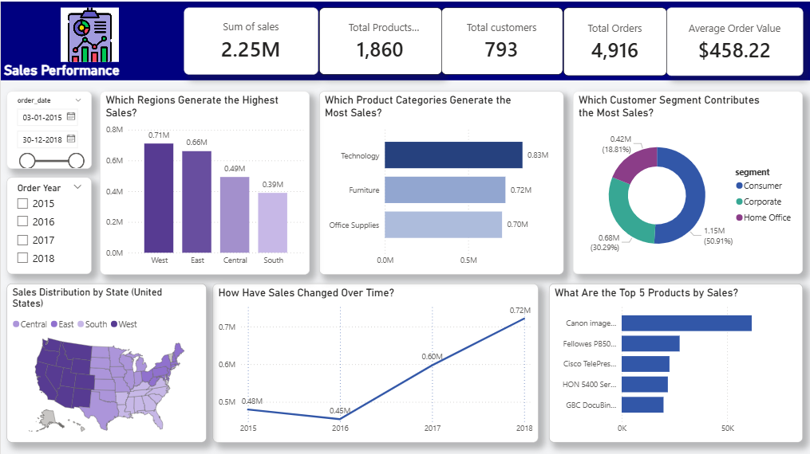
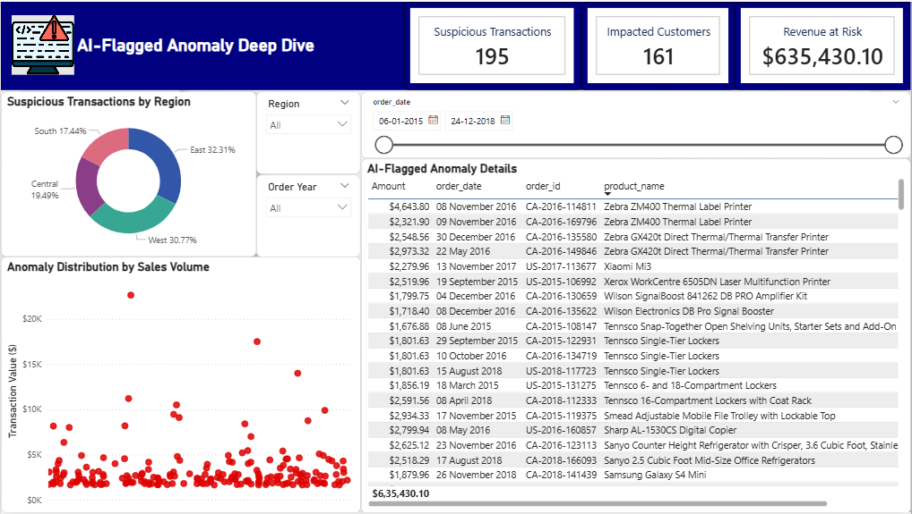

# 🚀 AI-Driven Revenue Integrity & Sales Intelligence Suite

## 📌 Project Overview
In modern retail environments, identifying "revenue leakage" is as critical as driving new sales. This project delivers an end-to-end data pipeline that combines **Business Intelligence** with **Unsupervised Machine Learning** to detect financial anomalies within $2.25M of transactional data.

By automating the ETL (Extract, Transform, Load) process and deploying an Anomaly Detection model, this solution isolates high-risk orders that traditional rule-based filters often miss.

---

## 📸 Dashboard Preview

*Figure 1: Executive Sales Performance & Geospatial Analysis*

*Figure 2: AI-Flagged Forensic Investigation Interface*

---

## 🛠️ Tech Stack & Architecture
| Layer | Technologies |
| :--- | :--- |
| **Data Engine** | Python (Pandas, NumPy) |
| **AI/ML** | Scikit-Learn (Anomaly Detection) |
| **Database** | SQL (SQLite) |
| **Visualization** | Power BI (DAX, Advanced Modeling) |
| **Workflow** | VS Code, Git/GitHub |

### The "Investigator" Pipeline:
1. **Validation:** Ingests raw data and performs automated cleaning via `data_cleaning.py`.
2. **Storage:** Relational modeling within a portable **SQLite** environment.
3. **Detection:** Machine Learning script identifies 195 outliers based on statistical variance in pricing and quantity.
4. **Action:** Power BI dashboard enables stakeholders to deep-dive into the "Exactly at Risk" revenue ($635K).

---

## 🔍 Key Insights & Business Value
- **Outlier Detection:** Successfully isolated 195 suspicious transactions.
- **Revenue at Risk:** Quantified a total of **$635,430.10** in anomalous sales.
- **Portability:** Built as a "Serverless" SQL architecture, allowing the full project to be shared and deployed instantly on any local machine.
- **Granular Forensic View:** Designed a custom scatter plot to map transaction value against the timeline, identifying specific periods of high risk.

---

## 📂 Repository Structure
- `scripts/`: Python ETL and ML logic.
- `data/processed/`: The `sales_database.db` SQL file.
- `dashboard/`: The interactive `.pbix` file.
- `README.md`: Project documentation.

---

## 👤 Contact & Author
**Dinesh Tanikanti** *Computer Science & Engineering | Data Investigator* [LinkedIn](www.linkedin.com/in/dinesh-tanikanti) | [Portfolio](YOUR_PORTFOLIO_URL)
